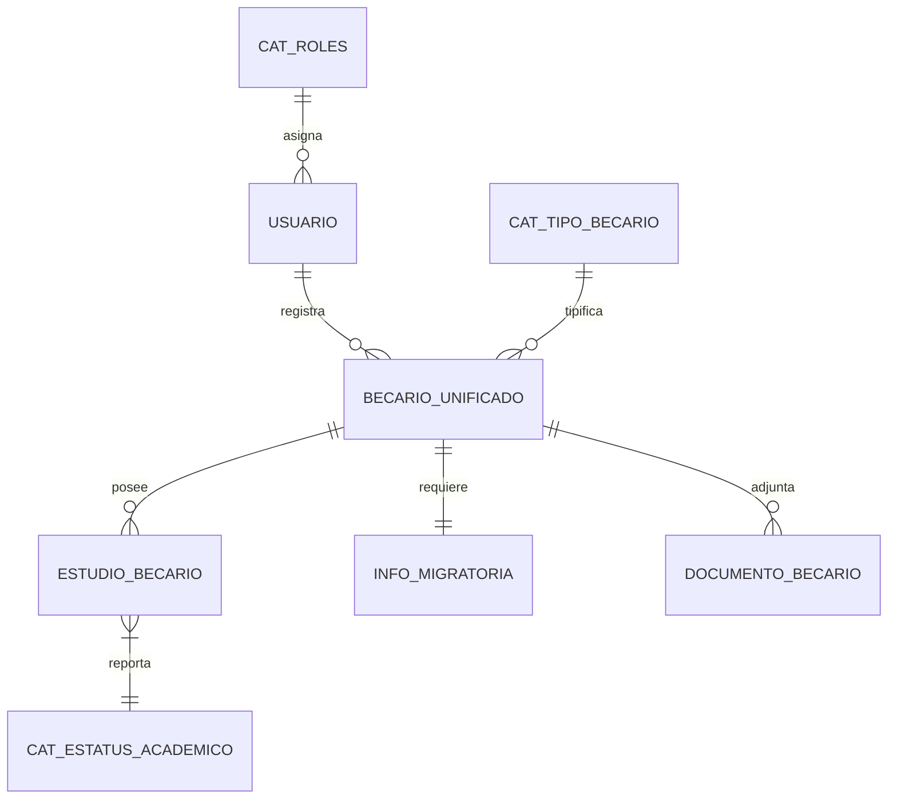

# Documentación de la Base de Datos V2 - Sistema de Becarios `becarios_v2`

Esta documentación describe la nueva estructura normalizada de la base de datos implementada con **Sequelize ORM**, diseñada para unificar los módulos de Becarios Nacionales, Exterior, Egresados y Extranjeros en un solo ecosistema robusto e íntegro.

---

## 1. Arquitectura de Unificación
A diferencia de la versión anterior que utilizaba tablas separadas para cada tipo de becario, la V2 utiliza un **Modelo de Entidad Única con Discriminador**:

- **Tabla Principal:** `becarios_unificados` (Almacena datos personales comunes).
- **Discriminador:** `id_tipo_becario` (Define si es Nacional, Exterior o Extranjero).
- **Relaciones:** La información académica y archivos se mueven a tablas satélites vinculadas por `id_becario` (UUID).

---

## 2. Diccionario de Datos (Tablas Principales)

### 2.1 Tabla: `becarios_unificados`
Es el corazón del sistema. Centraliza a toda persona registrada.
| Campo | Tipo | Descripción |
| :--- | :--- | :--- |
| `id` | UUID (PK) | Identificador único universal (v4). |
| `id_tipo_becario` | Integer (FK) | 1: Nacional, 2: Exterior, 3: Extranjero en VZLA. |
| `registrado_por` | Integer (FK) | ID del usuario (Analista) que realizó el registro. |
| `cedula` | String(30) | Número de identificación limpio (solo dígitos). |
| `nacionalidad` | String(2) | Flag de origen: "V" (Venezolano) o "E" (Extranjero). |
| `nombres` | String(150) | Nombres del becario (Normalizado: Primera mayúscula). |
| `apellidos` | String(150) | Apellidos del becario. |
| `correo` | String(150) | Correo electrónico institucional o personal. |
| `estado` / `municipio` | String | Códigos geográficos normalizados (01, 0101, etc). |
| `latitud` / `longitud` | String | Coordenadas GPS del domicilio del becario en VZLA. |

### 2.2 Tabla: `estudios_becario`
Almacena el historial y estatus académico actual.
| Campo | Tipo | Descripción |
| :--- | :--- | :--- |
| `id_becario` | UUID (FK) | Vínculo con la tabla unificada. |
| `id_estatus` | Integer (FK) | 1: Activo, 2: Egresado, 3: Suspendido. |
| `id_institucion` | Integer (FK) | Vínculo opcional con el catálogo `tbl_uner`. |
| `institucion_nombre` | String | Nombre textual de la universidad (para casos internacionales). |
| `anio_ingreso` | Integer | Año de inicio de estudios (YYYY). |
| `idiomas` / `ocupacion` | String | Datos adicionales (especial para egresados). |
| `trabajando` | String | Estatus laboral actual (si/no). |

### 2.3 Tabla: `usuarios`
Gestión de accesos al sistema administrativo.
| Campo | Tipo | Descripción |
| :--- | :--- | :--- |
| `id` | Integer (PK) | Identificador numérico (mantiene compatibilidad legacy). |
| `email` | String | Correo de acceso (Único). |
| `password` | Hash | Contraseña encriptada con Bcrypt. |
| `id_rol` | Integer (FK) | 1: Estudiante, 2: Admin, 3: Supervisor, 4: Analista. |

### 2.4 Tabla: `info_migratoria`
Extensión de datos para becarios internacionales o extranjeros.
| Campo | Tipo | Descripción |
| :--- | :--- | :--- |
| `pasaporte` | String | Número de pasaporte actual. |
| `visa_numero` | String | Número de visado (si aplica). |
| `fecha_vencimiento` | Date | Alertas de vencimiento de documentos legales. |

---

## 3. Integración por Módulos (Lógica de Negocio)

### 🇻🇪 Módulo: Becarios Nacionales
Se integra mediante `id_tipo_becario = 1`. Su cartografía está estrictamente vinculada a las tablas `tbl_estado`, `tbl_municipio` y `tbl_parroquia`. Se les asocia un `id_institucion` (Catálogo UNEARTE/UPT/etc).

### ✈️ Módulo: Becarios en el Exterior
Se integra mediante `id_tipo_becario = 2`. Utiliza los campos `latitud_pais` y `longitud_pais` para ubicar al becario en el mapa mundial. La institución se guarda principalmente de forma textual en `institucion_nombre` ya que no pertenecen al catálogo nacional.

### 🎓 Módulo: Egresados
No es un tipo de becario, sino un **Estatus**. Cualquier becario (Nacional o Exterior) cuya relación en `estudios_becario` posea un `id_estatus = 2` es considerado Egresado. Este módulo habilita los campos de `idiomas`, `ocupación` y `fecha_egreso`.

### 📄 Módulo: Internacionales en Venezuela (Extranjeros)
Se integra mediante `id_tipo_becario = 3`. Sus datos provienen principalmente de importaciones masivas (CSV). Se les asigna una `InfoMigratoria` obligatoria para el seguimiento de visas y pasaportes según el convenio ELAM u otros.

---

## 4. Diagrama de Relaciones (Simplificado)

---

## 5. Ventajas de la Nueva Estructura
1. **Integridad Referencial:** No existen "becarios huérfanos". Todo cambio en el estatus o tipo se refleja en un solo lugar.
2. **Escalabilidad:** Añadir un nuevo tipo de beca (ej. Postgrado) solo requiere un nuevo registro en el catálogo, no una tabla nueva.
3. **Búsqueda Global:** Se puede buscar un becario por cédula en todo el universo de la fundación con una sola consulta SQL.
4. **Normalización:** Nombres y apellidos separados permiten una mejor usabilidad y reportes profesionales.
